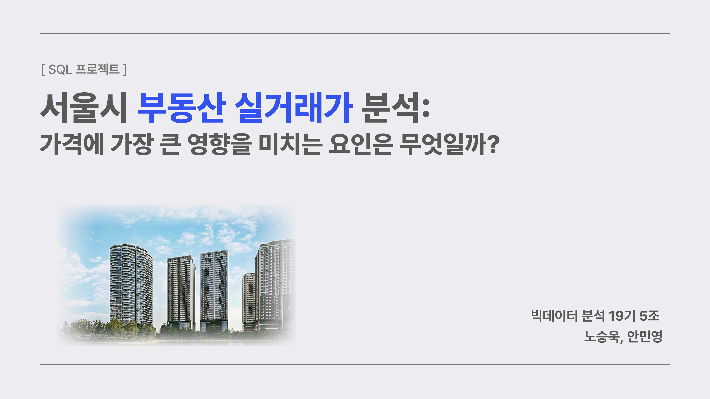
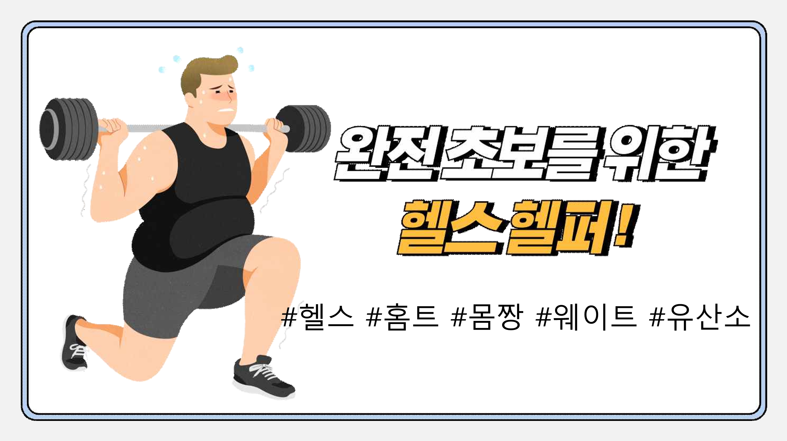

<h1>노승욱의 포트폴리오</h1>

 

## 🧑‍💻 Introduce

  <li>안녕하세요, 저는 <strong>데이터 분석가</strong> 직무에서 중요한 역할을 수행하기 위해 끊임없이 노력하며 성장하고 있습니다.</li>

<ul>
</ul>

 

<table style="width: 100%; border-spacing: 10px;">
  <tr>
    <td style="vertical-align: top; width: 50%;">
      <h2>📚 Career</h2>
      <ul style="list-style: none; padding: 0;">
        <li>👨‍🎓 <b>단국대학교 수학과 (졸업)</b></li>
        <li>2018.03 ~ 2024.08</li>
      </ul>
    </td>
    <td style="vertical-align: top; width: 50%;">
      <h2>📱 Contact</h2>
      <ul style="list-style: none; padding: 0;">
        <li>📞 <b>010-9204-1158</b></li>
        <li>📧 <b><a href="mailto:nosw19@naver.com" style="text-decoration: none; color: blue;">nosw19@naver.com</a></b></li>
      </ul>
    </td>
  </tr>
</table>

 

  <h2>🏅 Prize</h2>

<ul>
  <li>2024 대국민 물 빅데이터 공모전 장려상 (2024.08) 🎉</li>
</ul>

 

  <h2>🤼‍♂️ Activate</h2>

<ul>
  <table border="1">
  <tr>
    <th>내용</th>
    <th>일자</th>
  </tr>
  <tr>
    <td><strong>프로젝트 중심 빅데이터 융합 머신러닝 전문가 양성과정</strong></td>
    <td>2024.05 ~ 2024.11</td>
</table>

</ul>

 

# 프로젝트 포트폴리오

<table style="width: 100%; border-collapse: collapse; margin: 20px 0; table-layout: fixed;">
  <tr>
    <td style="text-align: center; vertical-align: top; border: 1px solid black;">
      
      

      

        <a href="./SQL프로젝트.pdf" style="text-decoration: none; color: blue; font-weight: bold;">
          <b>부동산 실거래가 예측</b>
        </a>
      

      

      

        SQL 쿼리를 사용하여 부동산의 실거래가를 예측하는 프로젝트입니다.
      

    </td>
    <td style="text-align: center; vertical-align: top; border: 1px solid black;">
      
      

      

        <a href="./수자원프로젝트.pdf" style="text-decoration: none; color: blue; font-weight: bold;">
          <b>대국민 물 빅데이터 공모전</b>
        </a>
      

      

      

        기상청과 수자원 데이터를 사용하여 가뭄을 예측하는 모델을 개발한 프로젝트입니다.
      

    </td>
  </tr>
  <tr>
    <td style="text-align: center; vertical-align: top; border: 1px solid black;">
      
      

      

        <a href="./세종시발표.pdf" style="text-decoration: none; color: blue; font-weight: bold;">
          <b>세종시 빅데이터 공모전</b>
        </a>
      

      

      

        세종시 공공 전기자전거 도입을 위한 최적의 입지 선정을 주제로 진행한 프로젝트입니다.
      

    </td>
    <td style="text-align: center; vertical-align: top; border: 1px solid black;">
      
      

      

        <a href="./세미프로젝트.pdf" style="text-decoration: none; color: blue; font-weight: bold;">
          <b>스낵 시장의 트렌드와 소비자 요구</b>
        </a>
      

      

      

        과자 매출액 데이터를 사용하여 효과적인 성장 전략 제안을 주제로 진행한 프로젝트입니다.
      

    </td>
  </tr>
  <tr>
    <td style="text-align: center; vertical-align: top; border: 1px solid black;">
      
      

      

        <a href="./파이널프로젝트.pdf" style="text-decoration: none; color: blue; font-weight: bold;">
          <b>헬스 헬퍼</b>
        </a>
      

      

      

        운동을 분류한 후 해당 운동의 자세를 평가해주는 헬퍼를 개발한 프로젝트입니다.
      

    </td>
    <td style="border: 1px solid black;"></td>
  </tr>
</table>

 

<table style="width: 100%; border-collapse: collapse; margin: 20px 0; table-layout: fixed; border: 1px solid black;">
  <!-- 프로젝트 테이블 내용 -->
</table>

 

  <h2>📑 Certificate</h2>

<table border="1">
  <tr>
    <th>자격증</th>
    <th>취득일</th>
  </tr>
  <tr>
    <td><strong>ADsP</strong> (데이터분석 준전문가)</td>
    <td>2024.09</td>
  </tr>
  <tr>
    <td><strong>SQLD</strong> (SQL 개발자)</td>
    <td>2024.09</td>
  </tr>
  <tr>
    <td rowspan="2"><strong>빅데이터 분석기사</strong></td>
    <td>2024.09 필기 합격</td>
  </tr>
  <tr>
    <td>2025 상반기 취득 예정</td>
  </tr>
</table>

